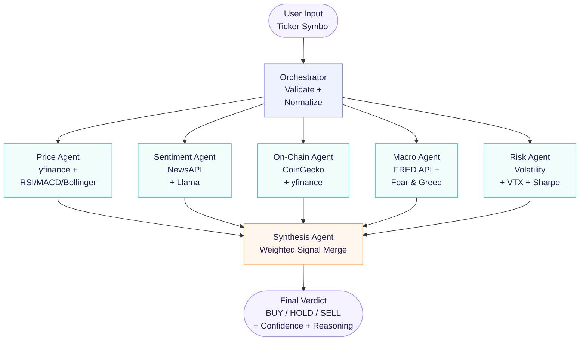

# 🧠 MarketMind: Parallel Multi-Agent Financial Analyst

MarketMind is a high-speed, parallel multi-agent AI system designed to analyze stocks and cryptocurrencies in under 5 seconds. By leveraging **LangGraph's fan-out architecture** and **Groq's Llama-3.3-70B** model, it simultaneously evaluates financial assets across 5 distinct dimensions before synthesizing a final BUY/HOLD/SELL verdict.

## 🏗 Architecture Flowchart

## 🚀 The Problem & The Solution
* **The Problem:** Sequential AI chains (Agent A → Agent B → Agent C) are bottlenecked by the slowest API call. A 4-second operation across 5 agents takes 20 seconds. In finance, speed is everything.
* **The Solution:** LangGraph’s parallel "fan-out to fan-in" pattern. All 5 agents execute simultaneously. Total wait time is reduced to the duration of the *slowest single agent* (~4 seconds).

## 🤖 Agent Breakdown
1. **Price Agent:** Analyzes 90-day price history, RSI, MACD, and Bollinger Bands (via yfinance).
2. **Sentiment Agent:** Evaluates the last 3 days of news headlines (via NewsAPI).
3. **On-Chain Agent:** Examines market cap rank, volume ratios, and momentum (via CoinGecko/yfinance).
4. **Macro Agent:** Contextualizes with DXY, Fed funds rate, yield curve, and Fear & Greed index (via FRED).
5. **Risk Agent:** Assesses annualized volatility, max drawdown, VIX, and Sharpe ratio.
6. **Synthesis Agent:** Awaits all 5 signals, computes a weighted score, and delivers the final verdict.

## 🛠 Tech Stack
- **Orchestration:** LangGraph & LangChain
- **LLM Engine:** Groq (Llama-3.3-70b-versatile)
- **UI:** Streamlit
- **Data Sources:** yfinance, NewsAPI, pycoingecko, fredapi

## 🔐 State Management
To prevent race conditions when 5 agents write to the state simultaneously, MarketMind uses `operator.add` as a reducer. This safely *appends* each agent's result to a list rather than overwriting it, ensuring no data is lost during the parallel execution superstep.
